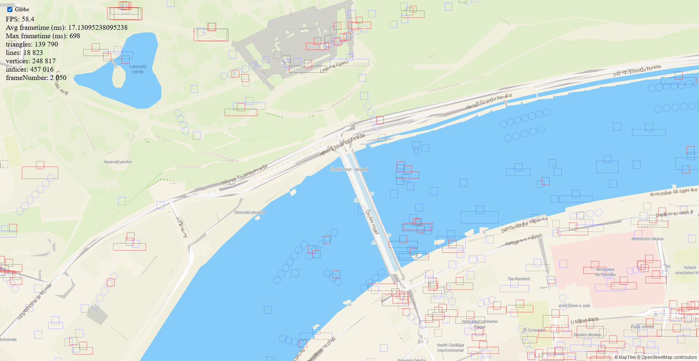

# Globe projection

This guide describes the inner workings of globe projection.
Globe draws the same vector polygons and lines as mercator projection,
ensuring a clear, unstretched image at all view angles and support for dynamic layers and geometry.

The actual projection is done in these steps:

- compute angular spherical coordinates of source tile data, which is in web mercator
- convert spherical coordinates to a 3D vector - a point on the surface of a unit sphere
- project the 3D vector using a common perspective projection matrix

So the globe is a unit sphere from the point of view of projection.
This also simplifies a lot of math, and is used extensively in `globe_transform.ts`.

Geometry is projected to the sphere in the vertex shader.

## Shaders

Most vertex shaders use the `projectTile` function, which
accepts a 2D vector of coordinates inside the currently drawn tile,
in range 0..EXTENT (8192), and returns its final projection that can
be directly passed to `gl_Position`.

The implementation of `projectTile` is automatically injected into the shader source code.
Different implementations can be injected, depending on the currently active projection.
Thanks to this many shaders use the exact same code for both mercator and globe,
although there are shaders that use `#ifdef GLOBE` for globe-specific code.

## Subdivision

If were were to draw mercator tiles with globe shaders directly, we would end up with a deformed sphere.
This is due to how polygons and lines are triangulated in MapLibre - the earcut algorithm
creates as few triangles as possible, which can sometimes result in huge triangles, for example in the oceans.
This behavior is desirable in mercator maps, but if we were to project the vertices of such large triangles to globe directly,
we would not get curved horizons, lines, etc.

TODO example image

For this reason, before a tile is finished loading, its geometry (both polygons and lines) is further subdivided.
This subdivision is handled in `subdividePolygon` and `subdivideVertexLine` functions in `src/render/subdivision.ts`

It is critical that subdivision is as fast as possible, otherwise it would significantly slow down tile loading.
Currently the fastest approach seems to be taking the output geometry from `earcut` and subdividing that further.

When modifying subdivision, beware that it is very prone to subtle errors, resulting in single-pixel seams.
Subdivision should also split the geometry in consistent places, so that polygons and lines match up correctly when
projected. We use subdivision that results in a square grid, visible in the figure below.

TODO subdivision granularity settings

## Floating point precision & transitioning to mercator

Shaders work with 32 bit floating point numbers (64 bit are possible on some platforms, but very slow).
The 23 bits of mantissa and 1 sign bit can represent at most 8M values,
but the circumference of the earth is roughly 40 000 km, which works out to
about one float32 value per 5 meters, which is insufficient for map.
Thus if we were to use globe projection at all zoom levels, we would unsurprisingly encounter precision issues.

To combat this, globe projection automatically switches to mercator projection around zoom level 12.
This transition is smooth, animated and can only be noticed if you look very closely,
because globe and mercator projections converge at high zoom levels, and around level 12
they are already very close.

The transition animation is implemented in the shader, in `interpolateProjection` function in `src/shaders/_projection_globe.vertex.glsl`.
It is controlled by a "globeness" parameter, also stored in `globe_transform.ts`.

# TODO

- transforms
- clipping
- atan
- projection transition
- subdivision
- clipping
- symbols
- circles
- controls

